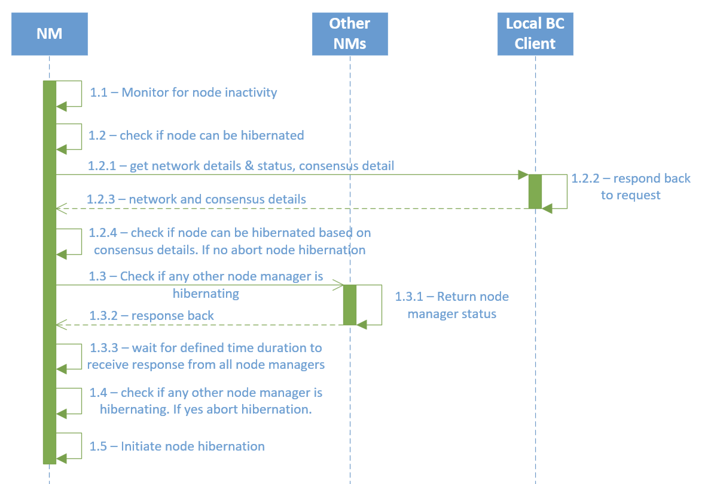

# Node Manager Design

## Architecture
The diagram below depicts a network of 3 nodes with node manager running on each node.

Each node manager acts as a proxy for the linked blockchain client and privacy managers and monitors the activity on these. The node manager also communicates with other node managers to retrieve the remote node status.

### Request flow when local and remote nodes are down

The below diagram depicts the flow of a private transactions flow for the following scenario:
* Node A and Node B are both running a GoQuorum and Tessera nodes with individual node managers monitoring each node
* Because of inactivity both GoQuorum and Tessera nodes are down
* A private transaction request is received at Node Manager A

The flow is as described below:

* **1.0:** A new RPC request for private transaction between GoQuorum Node A and B is sent to the Node Manager A (acting as a proxy for GoQuorum A). Node Manager A parses the transaction requests. For private transactions it extracts the privacy manager public keys from the `privateFor` argument of request. It then checks if there are entries in  [peers config](./CONFIG.md#Peers-config-file) for the public keys and identifies the remote node managers. If there are no entries, it assumes that the node is not managed by a node manager.

*  **1.1:** Node Manager A initiates the process to check if the local GoQuorum node and all recipient Tessera (Node B's Tessera in this case) are up. 

* **1.2:** Node Manager A checks the status of local GoQuorum and tessera. If these are down, triggers restart.

* **1.3.1 to 1.3.4:** Node Manager A sends a requst to Node Manager B via RPC call to check the remote node status. Node Manager B checks the status of linked GoQuorum and Tessera nodes. If the nodes are down it initiates the restart and responds back with status

* **1.4:** Once all nodes are up, Node Manager A forwards the request to Node A's GoQuorum for processing

* **1.4.1 to 1.4.8:** This is standard private transaction processing flow of GoQuorum. Once the private transaction is processed, GoQuorum responds back to Node Manager A with response

* **1.4.9, 1.4.10:** Node Manager A receives the response for the  transaction and responds back to client

### Node hibernation flow

The below diagram depicts the flow for hibernating a node upon configured inactivity time. T

* **1.1:** Node Manager monitors the activity/inactivity of the linked blockchain client and privacy manager.

* **1.2:** If the node has been inactive for more than configured time, Node Manager initiates the process to check if the node can be hibernated.

* **1.2.1 to 1.2.3:** Node manager makes a RPC api call to fetch the network and consensus status for the network to validate if the node can hibernate. This validation ensures that the network is still operation even when the current node hibernates. Please refer [here](./Design.md#consensus-validations-prior-to-hibernating-the-node) for details of validation. 
    * If the validation is successful, Node Manager proceeds to hibernate the node. 
    * If not, aborts the hibernation process, resets the inactivity timer and waits for the next inactivity trigger to attempt hibernation again
    
* **1.3 to 1.3.3:** In a race condition, it is possible that multiple node managers trigger node hibernation at the same time and thus break the minimum nodes requirement for the network to operational. To avoid such a scenario, in this step, node manager reaches out to other node managers to check if any remote node managers have initiated node hibernation. 
    * If yes, then it aborts the hibernation process, resets the inactivity timer and waits for the next inactivity trigger to attempt hibernation again. 
    * If no, it proceeds the next step of hibernating the node
    
* **1.4:** Node Manager initiates the hibernation of local blockchain client and privacy manager

### Consensus validations prior to hibernating the node
 The node manager can be brough up in Strict mode (by default) or in normal mode ( by setting `DisableStrictMode` to `true` in config). The below table explains the consensus validation logic applied to ensure that the overall network is still operational when the current node goes down. 

| BC Client | Consensus Engine | Strict Mode | Normal Mode |
| :---: | :---: | :--- | :--- |
| GoQuorum | Raft | - If the node is a **minter or peer**, it cannot be hibernated.     - For a **learner** node, hibernation is allowed | - **Minter** node cannot hibernate     - Maximum ***49%*** of **peer** nodes can hibernate    - **Learner** node can hibernate
| GoQuorum | Istanbul | - **Validator** nodes cannot hibernate     - **Non-validator** nodes can hibernate | - Maximum ***f*** validator nodes can hibernate in a network with ***3f + 1*** validator nodes     - Non-validator nodes can hibernate
| GoQuorum | Clique | - **Signer** nodes cannot hibernate     - **Non-signer** nodes can hibernate | - Maximum ***49%*** of signer nodes can hibernate     - **Non-signer** nodes can always hibernate
| Besu | Clique | - **Signer** nodes cannot hibernate     - **Non-signer** nodes can hibernate | - Maximum ***49%*** of signer nodes can hibernate     - **Non-signer** nodes can always hibernate

